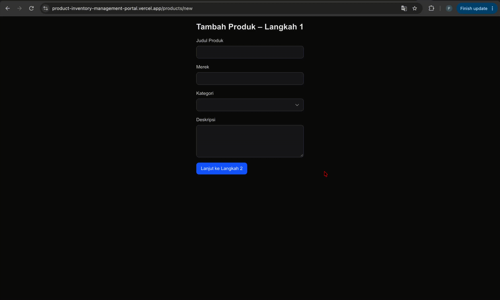
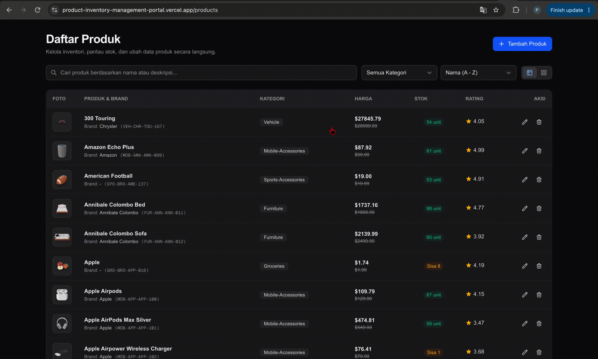

# Product Inventory Management Portal


## Running the project

Install dependencies and start the local server:

```bash
npm install
npm run dev
```

Open [http://localhost:3000](http://localhost:3000).

Run tests and generate coverage reports with:

```bash
npm test
npm run test:coverage
```

Other available scripts are `npm run build`, `npm start`, `npm run lint`, and
`npm run test:watch`.

[Live Vercel Link](https://product-inventory-management-portal.vercel.app/)

[Github Link](https://github.com/prasetiodc/product-inventory-management-portal)

## Evidence






## Technical rationale

### 1. Race Condition Handling

The search input waits 300 ms after the last keystroke before updating the
search filter. If the user keeps typing, the previous timer is cleared, which
reduces the number of requests.

RTK Query caches results by query arguments. A response for an earlier search
is stored under that search's arguments, not in the cache entry for a newer
search. Requests that have already started are not manually cancelled.

### 2. State Distribution Boundaries

I use each tool for the type of state it is best suited for:

- **Redux Toolkit** handles shared state such as filters, wizard data, and
  optimistic updates.
- **RTK Query** handles API data, caching, loading states, and errors.
- **React Hook Form** handles form values, validation, and form errors.

Form values stay in React Hook Form instead of being sent to Redux on every
keystroke. Submitted wizard data is shared between steps, and draft progress
is persisted separately in browser storage.

This keeps the state management simple and avoids unnecessary updates.

### 3. Rendering SKU variation fields

SKU variations are managed with React Hook Form's `useFieldArray`.

Each row uses `field.id` as the React key instead of the array index. This keeps the rows stable when adding or removing variations.

The inputs use `register` and stay uncontrolled while typing, which helps avoid unnecessary re-renders.

I use `append` and `remove` to add and remove variations.

For draft persistence, `subscribe` listens for form changes without making the
component re-render for each change.

### 4. Optimistic update recovery

For edit and delete actions, I update the UI first instead of waiting for the API response.

Before making the change, I save the original product data. If the API request fails, I use that data to restore the previous state.

For an edit, revertProduct restores the product. For a delete, addProduct adds the product back.

Failed operations are recorded in the optimistic slice and shown in a toast
with a retry option. When the request succeeds, the operation is marked as
completed. The hooks also simulate a 20% failure chance so the rollback path
can be seen in this demo.
